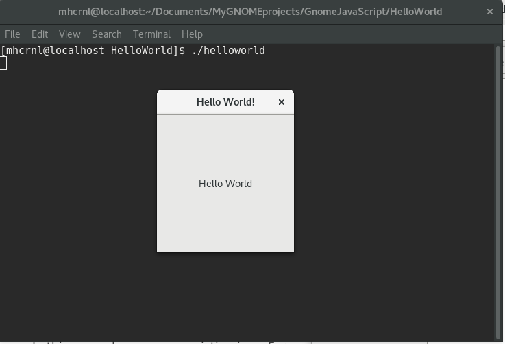

## Synopsis

OS: Fedora 24 / Tehnologies: **GNOME JavaScript** application.

At the top of the file there should be a short introduction and/ or overview that explains **what** the project is. This description should match descriptions added for package managers (Gemspec, package.json, etc.)

## Code Example

Show what the library does as concisely as possible, developers should be able to figure out **how** your project solves their problem by looking at the code example. Make sure the API you are showing off is obvious, and that your code is short and concise.

## Motivation

A short description of the motivation behind the creation and maintenance of the project. This should explain **why** the project exists.

## Installation

git clone https://github.com/mhcrnl/HelloWorld.git

####ATENTION! 

When you have the hello-world, hello-world.desktop.in, Makefile.am, configure.ac and autogen.sh files with correct information and rights you can :

Build and install this program:

./autogen.sh --prefix=/home/your_username/.local
make install

-------------
Running the first line above creates the following files:

aclocal.m4
autom4te.cache
config.log
config.status
configure
hello-world.desktop
install-sh
missing
Makefile.in
Makefile

Running "make install", installs the application in /home/your_username/.local/bin
and installs the hello-world.desktop file in /home/your_username/.local/share/applications

You can now run the application by typing:

1. ./helloworld in Terminal;
2. "Hello World" in the Overview.

----------------
To uninstall, type:

make uninstall

----------------
To create a tarball type:

make distcheck

This will create hello-world-1.0.tar.xz

Provide code examples and explanations of how to get the project.

## API Reference

Run: gjs helloworld.js

Depending on the size of the project, if it is small and simple enough the reference docs can be added to the README. For medium size to larger projects it is important to at least provide a link to where the API reference docs live.

## Tests

Describe and show how to run the tests with code examples.

## Contributors

Let people know how they can dive into the project, include important links to things like issue trackers, irc, twitter accounts if applicable.

## License

A short snippet describing the license (MIT, Apache, etc.)
